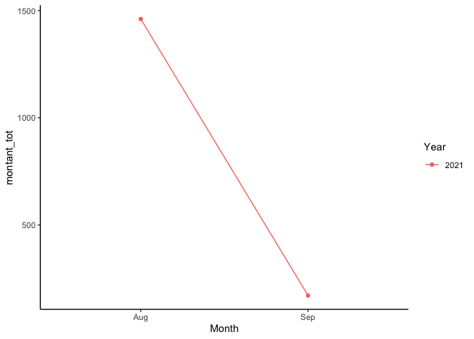

# tangerinr

Librairie d’analyse et de visualisation pour des relevés de crédit en
format .CSV exportés de Tangerine.

### Comment utiliser la librairie

 

**1. Installer la librairie à partir de github puis la charger**

``` r
library(devtools)
install_github("malcolmosh/tangerinr")
library(tangerinr)
```

 

**2. Fonction tangimport**: Cette fonction vous permet d’importer les
relevés en format csv situés dans votre espace de travail actuel et de
les fusionner au sein d’un même objet. **ATTENTION : l’extension du
fichier csv doit être en majuscules (“.CSV”)**

``` r
# ?tangimport #documentatioj
setwd("/Users/osher/OneDrive/Hec MSc/3. Logiciels statistiques/Travail final") #remplacez par votre répertoire de travail
getwd() #vérifiez votre répertoire de travail
```

    ## [1] "/Users/osher/OneDrive/Hec MSc/3. Logiciels statistiques/Travail final"

``` r
importation = tangimport(importation) #importer vos fichiers
```

    ## # A tibble: 24 × 5
    ##    `Date de l'opération` Transaction Nom           Description           Montant
    ##    <date>                <chr>       <chr>         <chr>                   <dbl>
    ##  1 2021-09-04            DÉBIT       AMZN Mktp CA… Remises accumulées :…  -77.7 
    ##  2 2021-09-03            DÉBIT       PAYPAL *X2 R… Remises accumulées :…  -93.2 
    ##  3 2021-08-29            DÉBIT       COUCHE-TARD … Remises accumulées :…   -2.29
    ##  4 2021-08-26            DÉBIT       MEC MOUNTAIN… Remises accumulées :… -408.  
    ##  5 2021-08-26            DÉBIT       BOULANGERIE … Remises accumulées :…   -3.7 
    ##  6 2021-08-24            DÉBIT       DOLLARAMA # … Remises accumulées :…   -2.3 
    ##  7 2021-08-24            DÉBIT       MICROSOFT*XB… Remises accumulées :…  -19.5 
    ##  8 2021-08-24            CRÉDIT      PAIEMENT - M… <NA>                   987.  
    ##  9 2021-08-20            DÉBIT       LES PRODUITS… Remises accumulées :…  -53.4 
    ## 10 2021-08-20            DÉBIT       MATERIAUX VI… Remises accumulées :…   -3.78
    ## # … with 14 more rows

 

**3. Fonction tan_agreg** : cette fonction permet d’afficher une
agrégation de vos dépenses par mois et par année. Ses arguments :

-   data, votre jeu de données importé par la fonction tangimport plus
    haut
-   **tout=TRUE** (par défaut), si vous souhaitez afficher toutes les
    dépenses
-   si **tout=FALSE**, alors indiquez **mois=01**, si vous souhaitez
    afficher un mois de calendrier précis (01-12)

``` r
# ?tan_agreg #documentation

tan_agreg(importation) #afficher toutes les dépenses 
```

    ## # A tibble: 2 × 2
    ##   moistr montant_tot
    ##    <dbl>       <dbl>
    ## 1      8       1461.
    ## 2      9        171.

``` r
tan_agreg(importation, tout=FALSE,mois=09) #n'afficher que les dépenses d'avril
```

    ## # A tibble: 1 × 2
    ##   moistr montant_tot
    ##    <dbl>       <dbl>
    ## 1      9        171.

 

**4. Fonction tan_graphique** : cette fonction permet d’afficher un
graphique de vos dépenses mensuelles sur 12 mois, avec une couleur
différente par année. Ses arguments:

-   data, votre jeu de données importé par la fonction tangimport plus
    haut
-   **tout=TRUE** (par défaut), si vous souhaitez afficher les dépenses
    de toute la période.
-   **annee=2020**, si vous souhaitez sélectionner une année précise.
    Indiquez l’année en format numérique.

``` r
#  ?tan_graphique #documentation

tan_graphique(importation)
```



``` r
tan_graphique(importation, tout=FALSE,annee=2021)
```


